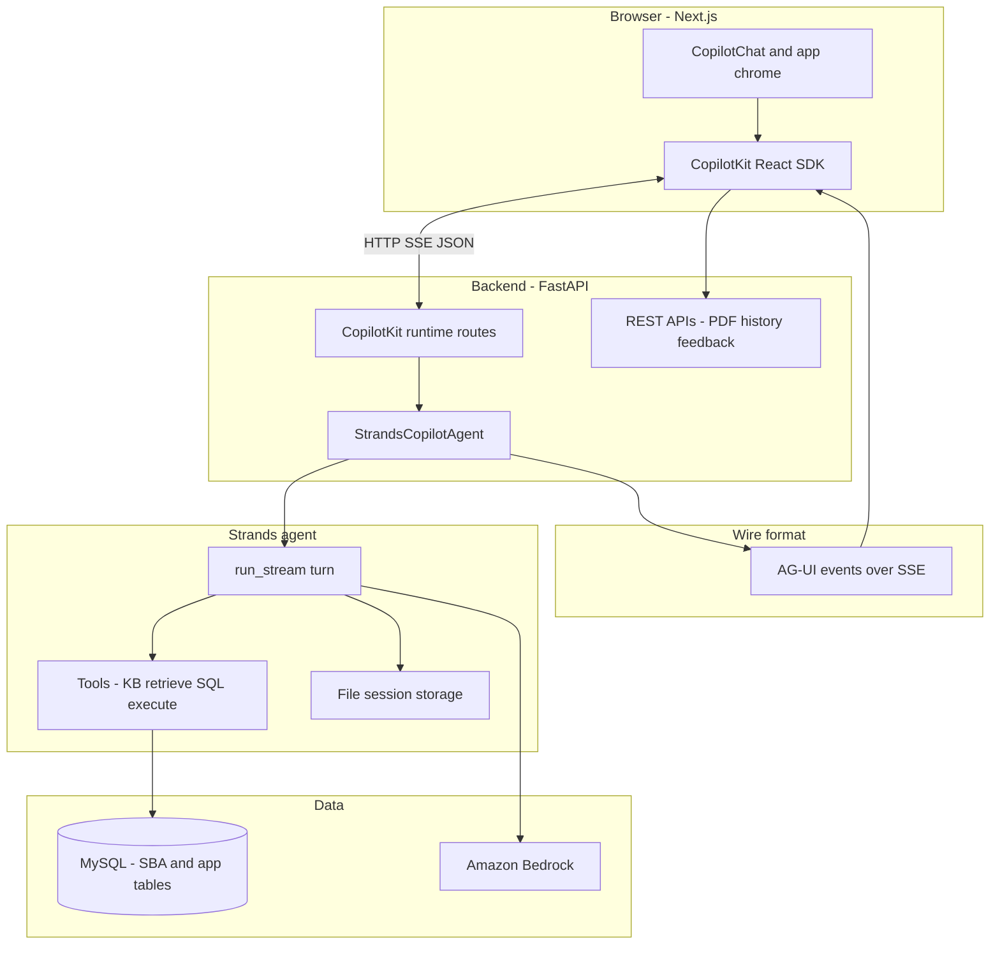

# Architecture: Strands + CopilotKit + AG-UI

**Audience:** Engineering and product leadership  
**Scope:** How the SBA analyst chat connects the Next.js UI, CopilotKit runtime, and Strands agent over the AG-UI streaming protocol.

---

## Purpose

End users chat in a **CopilotKit**-powered UI. Each turn is executed by a **Strands** agent (AWS Bedrock) that can query SBA loan data. Assistant output and tool results reach the browser as **AG-UI** events over **Server-Sent Events (SSE)** so the UI can stream text, render the SQL action, and drive follow-on features (PDF, feedback).

---

## High-level architecture



---

## Layer summary

| Layer | Role |
|--------|------|
| **CopilotKit (client)** | Chat UI, thread id, agent name, optional public key for observability; calls the runtime URL. |
| **CopilotKit (FastAPI)** | Registers the remote agent; handles agent execute, info, and related HTTP endpoints. |
| **StrandsCopilotAgent** | Maps one user turn into AG-UI frames: run lifecycle, streaming assistant text, synthetic `execute_sql` tool frames for the frontend, final state snapshot. |
| **AG-UI helpers** | Build SSE `data: {...}` lines (`RUN_*`, `TEXT_MESSAGE_*`, `TOOL_CALL_*`, etc.) compatible with CopilotKit’s AG-UI client. |
| **Strands** | Orchestrates the model, tools, and session persistence on disk (per thread). |
| **REST beside Copilot** | PDF generation, chat history listing, positive feedback—same origin/CORS as the app, not part of the AG-UI stream. |

---

## Repository layout (Strands / Copilot path)

High-signal folders only. The package also contains **Chainlit** and **Streamlit** UIs under `ui/` and `service/streamlit/`; they are separate entry points from the Next.js + CopilotKit app.

### Backend — `src/smart_report_analyst/`

```text
src/smart_report_analyst/
├── app.py                      # FastAPI application
├── config/                     # Settings and environment
├── routes/
│   └── routes.py               # CopilotKit runtime mount, REST: PDF, history, feedback
├── integrations/
│   ├── agui_stream.py          # AG-UI SSE event builders
│   └── copilotkit.py           # CopilotKit remote endpoint + info HTML patch
└── service/
    ├── strands/
    │   ├── agent.py            # StrandsCopilotAgent → AG-UI stream
    │   ├── runner.py           # Async turn: chunks + final tool_result
    │   ├── tools/              # execute_sql, KB retrieve (Bedrock KB)
    │   ├── agents/             # Strands agent / orchestrator definitions
    │   ├── session/            # File-backed sessions (thread ↔ storage)
    │   └── conversation/       # Conversation manager wiring
    ├── bedrock/                # Model + knowledge base clients
    ├── persistence/mysql/      # App SQL execution, Chainlit store, etc.
    ├── report_generation/      # PDF build + HTTP request models
    └── feedback/               # Positive feedback + snapshot index for thumbs-up
```

### Frontend — `frontend/src/`

```text
frontend/src/
├── app/                        # Next.js App Router (layout, home page)
├── components/
│   ├── ChatInterface.tsx       # CopilotChat, execute_sql action, observability hooks
│   ├── SqlPdfReport.tsx        # PDF fetch + preview overlay
│   └── HistorySidebar.tsx      # Session list from /api/history
├── providers/
│   └── CopilotRuntimeProvider.tsx   # CopilotKit provider + thread + public API key
├── context/
│   └── AppContext.tsx          # Active thread id for Copilot + sidebar
└── lib/
    ├── env.ts                  # API base URL, Copilot runtime URL, public key
    └── api.ts                  # Shared fetch helpers (if used)
```

---

## Design choices (short)

1. **AG-UI over raw Copilot NDJSON** — The stream matches `@ag-ui/core` event shapes so the React client can parse and verify the run incrementally.  
2. **Synthetic frontend `execute_sql`** — The model runs SQL on the server; the adapter re-emits a frontend `execute_sql` action with query + results so CopilotKit can render the report strip and call PDF/feedback APIs without exposing raw Strands internals to the UI.  
3. **Thread = Strands session** — CopilotKit `threadId` aligns with on-disk session folders for history and continuity.  
4. **CopilotKit compatibility patch** — Runtime `info` exposes agents as a name-keyed map so the UI resolves `loan_report_analyst_agent` correctly.

---

## Related code (for implementers)

- Agent adapter: `src/smart_report_analyst/service/strands/agent.py`  
- AG-UI framing: `src/smart_report_analyst/integrations/agui_stream.py`  
- Runtime registration: `src/smart_report_analyst/routes/routes.py` (CopilotKit + REST)  
- CopilotKit bridge: `src/smart_report_analyst/integrations/copilotkit.py`  
- Frontend shell: `frontend/src/providers/CopilotRuntimeProvider.tsx`, `frontend/src/components/ChatInterface.tsx`
