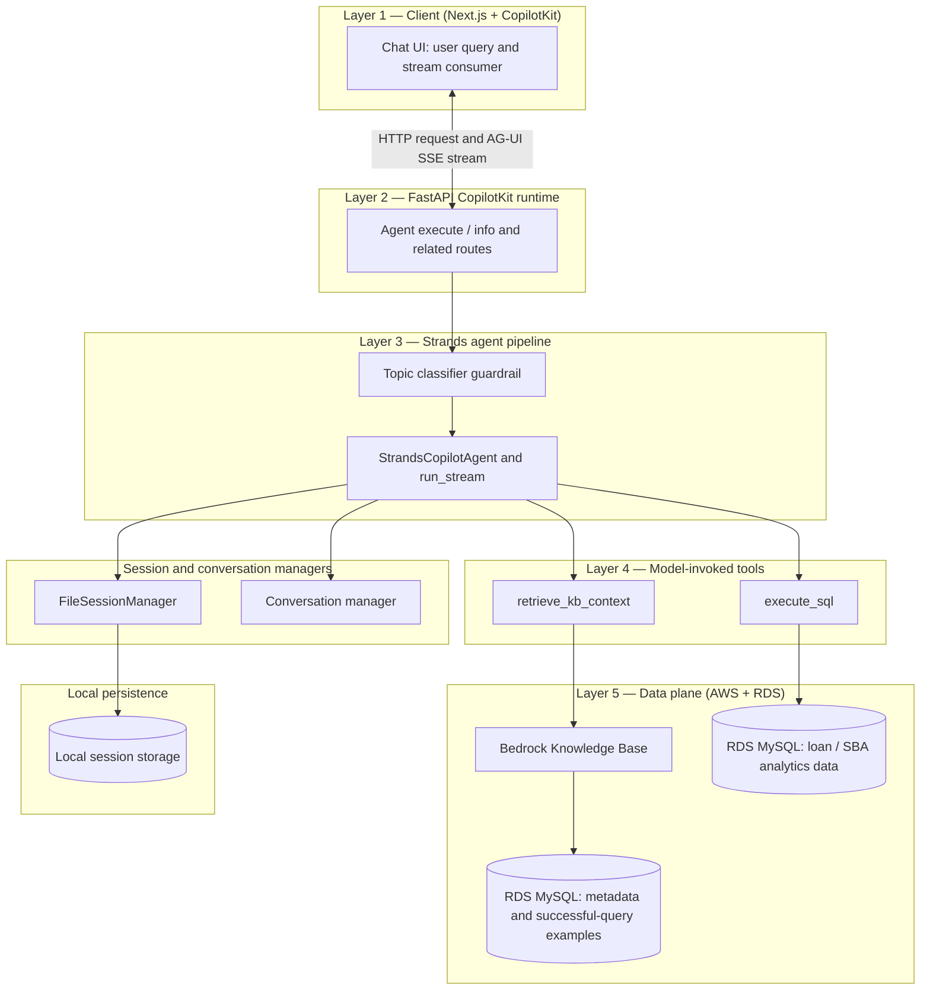
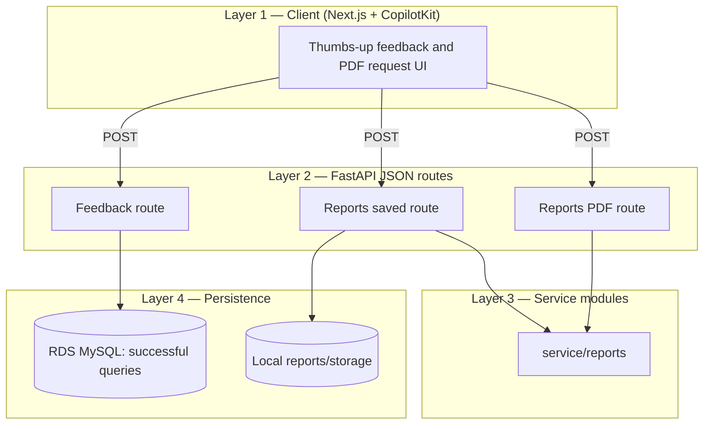

# Architecture: Strands + CopilotKit + AG-UI

**Audience:** Engineering and product leadership  
**Scope:** How the SBA analyst chat connects the Next.js UI, CopilotKit runtime, and Strands agent over the AG-UI streaming protocol.

---

## Purpose

End users chat in a **CopilotKit**-powered UI. Each turn is executed by a **Strands** agent (AWS Bedrock) that can query SBA loan data. Assistant output and tool results reach the browser as **AG-UI** events over **Server-Sent Events (SSE)** so the UI can stream text, render the SQL action, and drive follow-on features (PDF, feedback).

---

## Architecture and Workflow for Conversations

End-to-end flow for a single analyst question (high level, top → bottom):

1. **CopilotKit UI (user query)** — User message in the Next.js chat; CopilotKit calls the configured runtime URL.
2. **FastAPI layer** — CopilotKit remote runtime (agent execute, `info`, etc.) on the same app as other JSON routes.
3. **Agent-User Interaction Protocol (AG-UI) events over Server-Sent Events (SSE)** — Response body is a stream of `data: {<json>}\n\n` frames; event types follow **AG-UI** (e.g. `RUN_*`, `TEXT_MESSAGE_*`, `TOOL_CALL_*`, `REASONING_*`, `STEP_*`). CopilotKit parses this stream in the browser.
4. **Classifier (guardrail)** — Rule-based **topic classifier** runs **before** the model turn; off-topic messages are refused without calling Bedrock.
5. **Orchestrator (Strands agent)** — `StrandsCopilotAgent` maps the Strands turn into AG-UI frames; **`run_stream`** drives the Strands **`Agent`** (model + tools + optional file session / conversation managers).
6. **Tools** (model-invoked):
   - **`retrieve_kb_context`** → **Amazon Bedrock Knowledge Bases** retrieval, with a **Kendra Gen AI** index as a **data source** backing schema context and example SQL (including material related to **loan metadata** and **successful query** examples, per KB configuration).
   - **`execute_sql`** → **Amazon RDS (MySQL)** — analytical **loan / SBA data** (primary tables the model queries for result sets).



*Deployment note:* The KB does not typically open a live JDBC connection to RDS at retrieve time; **RDS1** represents content that is **indexed into** the KB (or otherwise aligned with app tables for metadata and stored examples), while **`execute_sql`** hits **RDS2** directly for runtime analytics.

---

## Architecture and Workflow for User Feedback and Report Generation

These paths use the **same FastAPI app** but are **not** part of the AG-UI over **SSE (Server-Sent Events)** chat stream:

1. **CopilotKit UI (user feedback)** — e.g. thumbs-up on a message; client POSTs to the API.
2. **FastAPI** — Feedback route resolves the stored SQL snapshot and persists a **successful query** record.
3. **RDS MySQL** — **Successful queries** updated for future retrieval / analytics.

**PDF report:** the UI POSTs query + results to a **report** route; **FastAPI** uses **`service/reports/`** (ReportLab + `ReportPdfRequest`) to build PDF bytes.

**Saved reports (dashboard):** the UI can POST to **`/api/reports/saved`** with the same PDF payload plus `thread_id` and `agent_id`. The backend persists a **SQLite** catalog at `reports/storage/catalog.sqlite` and stores each report under `reports/storage/files/<id>/` (`report.pdf` + `snapshot.json`). The Next.js **Reports** page lists them; **`/?thread=<uuid>`** deep-links back into chat.



*These flows are plain HTTP/JSON; they do not use the AG-UI **SSE (Server-Sent Events)** stream.*

---

## Service modules (backend)

Primary packages under `service/` for this product surface:

| Module | Role |
|--------|------|
| **`service/strands/`** | Strands **orchestrator**: `agents/` (agent factory), `agent.py` (Copilot adapter), `runner.py`, `tools/` (KB + SQL), `session/`, `conversation/`, guardrails. |
| **`service/reports/`** | PDF generation (`manager.py`), HTTP request models (`report_pdf.py`), saved-report SQLite + disk store (`reports_store.py`, `reports_models.py`). |
| **`service/feedback/`** | Positive feedback handling and snapshot index (message id → SQL) for thumbs-up persistence. |

Supporting: **`service/bedrock/`** (model + KB clients), **`service/persistence/mysql/`** (app data layer, SQL execution), **`integrations/`** (AG-UI over **SSE (Server-Sent Events)** helpers, CopilotKit wiring).

---

## Layer summary

| Layer | Role |
|--------|------|
| **CopilotKit (client)** | Chat UI, thread id, agent name, optional public key for observability; calls the runtime URL. |
| **CopilotKit (FastAPI)** | Registers the remote agent; handles agent execute, `info`, and related HTTP endpoints. |
| **StrandsCopilotAgent** | Maps one user turn into AG-UI frames: run lifecycle, streaming assistant text, synthetic `execute_sql` tool frames for the frontend, final state snapshot. |
| **AG-UI helpers** | Build **SSE (Server-Sent Events)** `data: {...}` lines (`RUN_*`, `TEXT_MESSAGE_*`, `TOOL_CALL_*`, etc.) compatible with CopilotKit’s AG-UI client. |
| **Strands** | Orchestrates the Bedrock model, tools, and session persistence on disk (per thread). |

---

## Repository layout (Strands / Copilot path)

### Backend — `src/smart_report_analyst/`

```text
src/smart_report_analyst/
├── app.py                      # FastAPI application
├── config/                     # Settings and environment
├── routes/
│   └── routes.py               # CopilotKit runtime mount; reports PDF + saved reports; history; feedback
├── integrations/
│   ├── agui_stream.py          # AG-UI over SSE (Server-Sent Events) frame builders
│   └── copilotkit.py           # CopilotKit remote endpoint + info HTML patch
└── service/
    ├── agent_trace/            # TraceEvent + mapper → AG-UI (agent-agnostic)
    ├── strands/
    │   ├── agent.py            # StrandsCopilotAgent → AG-UI stream
    │   ├── runner.py           # Async turn: merged Strands stream + trace queue → chunks + trace + tool_result
    │   ├── tools/              # execute_sql, KB retrieve (Bedrock KB); tools enqueue TraceEvent while running
    │   ├── agents/             # Strands agent / orchestrator definitions
    │   ├── session/            # File-backed sessions (thread ↔ storage)
    │   └── conversation/       # Conversation manager wiring
    ├── bedrock/                # Model + knowledge base clients
    ├── persistence/mysql/      # App SQL execution
    ├── reports/                  # PDF build, saved reports library (SQLite + local files)
    └── feedback/               # Positive feedback + snapshot index for thumbs-up
```

### Frontend — `frontend/src/`

```text
frontend/src/
├── app/                        # Next.js App Router (thin routes → modules)
├── modules/
│   ├── chat/                   # Chat shell, Copilot UI, thread deep-link, sidebar
│   └── reports/                # Saved reports dashboard + SqlResultPdfReport (execute_sql PDF card)
├── components/
│   └── agent-trace/            # Collapsible Trace UI (ReasoningTraceMessage)
├── providers/
│   ├── AppContext.tsx          # Active thread id + agent selection for Copilot + sidebar
│   └── CopilotRuntimeProvider.tsx   # CopilotKit provider + thread + public API key
└── lib/
    ├── env.ts                  # API base URL, Copilot runtime URL, public key
    └── api.ts                  # Shared fetch helpers (history, reports list)
```

---

## Live agent trace (single reasoning card)

During a turn, the server surfaces **live** tool/model trace in **one** open AG-UI **`reasoning`** message for the whole run:

1. **`StrandsTurnState`** holds an `asyncio.Queue` and trace metadata (`run_id`, `thread_id`, `agent_name`) for the turn.
2. **`retrieve_kb_context`** and **`execute_sql`** are async tools: they **`await`** the trace queue on the same event loop as **`run_stream`**. Blocking boto3 KB retrieve runs in **`asyncio.to_thread`** so OTel/context is not bridged with **`run_coroutine_threadsafe`**.
3. **`run_stream`** merges the Strands `stream_async` iterator with the queue so trace events yield **`{"type":"trace","data": TraceEvent}`** interleaved with **`chunk`** events.
4. **`StrandsCopilotAgent`** opens **`REASONING_*`** immediately after **`RUN_STARTED`**, appends **`REASONING_MESSAGE_CONTENT`** + **`STEP_*`** + **`CUSTOM`** from **`trace_events_to_sse_frames`** for **every** trace event (including after assistant text has started), then closes **`REASONING_*`** once at the end of the turn before **`TEXT_MESSAGE_END`**. Assistant text streams as **`TEXT_MESSAGE_*`** in parallel.
5. **Frontend** — `CopilotChat` **`RenderMessage`** renders **`role === "reasoning"`** via **`ReasoningTraceMessage`** (single collapsible Trace).

**Note:** The synthetic **`execute_sql`** AG-UI tool sequence remains the bridge for **`useCopilotAction`** (PDF widget). Trace lines describe **server-side** KB/SQL work; labels in the UI distinguish that from the report card.

---

## Design choices (short)

1. **AG-UI over raw Copilot NDJSON** — The stream matches `@ag-ui/core` event shapes so the React client can parse and verify the run incrementally.  
2. **Synthetic frontend `execute_sql`** — The model runs SQL on the server; the adapter re-emits a frontend `execute_sql` action with query + results so CopilotKit can render the report strip and call PDF/feedback APIs without exposing raw Strands internals to the UI.  
3. **Thread = Strands session** — CopilotKit `threadId` aligns with on-disk session folders for history and continuity.  
4. **CopilotKit compatibility patch** — Runtime `info` exposes agents as a name-keyed map so the UI resolves named agents (e.g. `wlr_reporting_agent`) correctly.

---

## Related code (for implementers)

- Agent adapter: `src/smart_report_analyst/service/strands/agent.py`  
- AG-UI framing: `src/smart_report_analyst/integrations/agui_stream.py`  
- Runtime registration: `src/smart_report_analyst/routes/routes.py` (CopilotKit runtime, reports, history, feedback)  
- CopilotKit bridge: `src/smart_report_analyst/integrations/copilotkit.py`  
- Frontend shell: `frontend/src/providers/AppContext.tsx`, `frontend/src/providers/CopilotRuntimeProvider.tsx`, `frontend/src/modules/chat/ChatInterface.tsx`, `frontend/src/modules/reports/SqlResultPdfReport.tsx`
