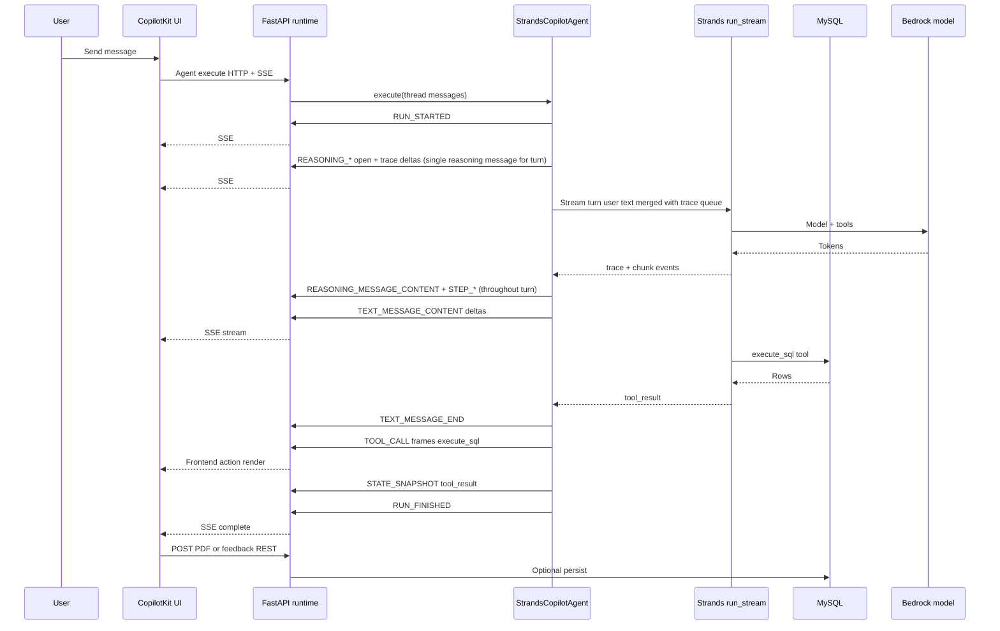

# Workflow: Strands + CopilotKit + AG-UI

**Audience:** Engineering and product leadership  
**Scope:** What happens from a user message to streamed reply, SQL execution, and optional PDF / thumbs-up—without implementation noise.

---

## End-to-end turn (happy path)

---

## Phases in plain language

1. **Connect** — The SPA loads CopilotKit with a runtime URL, thread id, and agent name. The runtime advertises the agent via `info` and accepts execute requests.  
2. **Start run** — The server opens an SSE stream and emits **run started** so the client can bind this stream to the active turn.  
3. **Trace** — One open **`reasoning`** message streams tool/model trace (**`REASONING_MESSAGE_CONTENT`**, **`STEP_*`**) for the whole turn; it closes at turn end.  
4. **Stream answer** — Strands drives the model; assistant text is forwarded as **text message** chunks (AG-UI), interleaved with trace updates.  
5. **Execute SQL** — The `execute_sql` tool runs against MySQL; the final tool payload is captured for this turn.  
6. **Bridge to UI** — The adapter emits **tool call** events that CopilotKit maps to a **frontend** `execute_sql` action so the chat can show the report card and request a PDF.  
7. **Finish** — **State snapshot** and **run finished** close the turn; the UI shows the full message and any custom widgets.  
8. **Follow-ups** — The browser calls separate REST endpoints (e.g. PDF generation, positive feedback) using data from the action; these are not part of the AG-UI event stream.

---

## What managers should remember

- **One chat turn** = one AG-UI **run** (started → streamed → finished).  
- **Strands** owns reasoning, tools, and session files; **CopilotKit** owns the chat UX and protocol.  
- **AG-UI** is the contract between FastAPI and the React client for streaming.  
- **Heavy side effects** (PDF bytes, saving “helpful” SQL) are intentionally **REST** beside the stream so the protocol stays small and cacheable.

---

## Edge cases (brief)

| Situation | Behavior |
|-----------|----------|
| Empty user message | Run completes with empty snapshot; no Strands work. |
| SQL error | Tool result carries error; adapter skips synthetic `execute_sql` frames; no PDF strip. |
| New thread | New CopilotKit `threadId` → new Strands session path on disk. |

---

## Companion document

See [strands-copilot-agui-architecture.md](./strands-copilot-agui-architecture.md) for the static system diagram, layer table, and **backend + frontend directory layout**.
